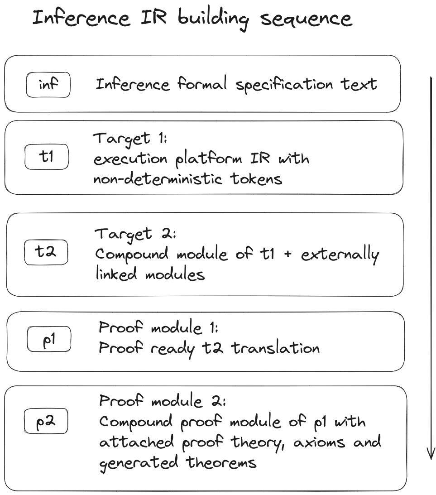

# 3 General Description

Inference is a formal specification language that aims to provide a straightforward way to specify the correctness properties of Web3 native application algorithms.

> [!IMPORTANT]
> Based on this fact, the following important consequences follow:
> 1. Inference is a Turing-complete language.
> 2. It is designed to be used for both formal specification and high-assurance application development.

## 3.1 Non-Deterministic Computations

The cornerstone idea behind Inference is utilization of non-determinism as a method to express general statements about classical deterministic computations. At face value non-deterministic specification can be seen as a formal generalization of the unit testing methodology, which we roughly define as expressing programmer's intentions about behavior of individual program components with additional snippets of code (in the same or almost the same language as main codebase), and then using some sort of automated process to check if actual implementation corresponds to stated intentions.

The established methodology suggests stating intentions as individual cases feeding specific hand-picked input data to subject functions in order to check their behavior against reference results. This process relies on the straightforward execution of wrapped calls to tested code, but such approach can hide an embedded flaw — no matter how comprehensive a test suite is, one can never be sure if a program behaves correctly in cases that are outside of its necessarily limited test coverage.

Inference addresses that problem by allowing the programmer to express statements about algorithm behavior which are much more general compared to the simplistic "given this specific input, the function must return this specific output" idea and its variations. That is done by extending the classical imperative execution model with idioms of non-determinism and logical quantification represented by the following keywords:

- [uzumaki](./statements.md#91021-uzumaki)
- [forall](./statements.md#94-forall)
- [assume](./statements.md#96-assume)
- [exists](./statements.md#95-exists)

### 3.1.1 Uzumaki

The `@` keyword (pronounced u-zu-ma-ki うずまき 🌀 渦巻き "whirlpool / maelstrom / vortex") is a primitive expression that can occupy the `rval` slot of any primitive type, serving as a point of non-deterministic branching of passing computation. Its evaluation splits the execution path into a finite set of subpaths, each of which differs from the others only by `@`'s result, collectively covering all possible values that the given type can hold.

Representing undetermined values, this construct lays the foundation for every formal specification, idiomatically expressed in Inference through modeling the non-deterministic behavior of covered functions and modules. As the classical imperative programming paradigm doesn't have operational semantics for non-deterministic computations, `@` can be evaluated only inside specialized quantified contexts explained below.

Manipulating undefined values in a non-deterministic spec resembles mechanisms of symbolic execution widely employed in program analysis, and indeed `@` can rightfully be seen as an analog to the symbolic input value of an ordinary constraint solver. However, important paradigm differences need to be taken into account.

While symbolic execution is usually applied to classical deterministic algorithms that are not aware of their non-deterministic interpretation environment, Inference embraces non-determinism as an organic part of its model, allowing us to make quantified statements (see below) about undefined values inside the algorithm itself, turning it into a language for expression of logical properties.

### 3.1.2 Forall

`forall` (execution paths) is a quantifying block that passes control down the flow without any side effects, iff the execution of its body sucessfully terminates for all possible non-deterministic paths emanating from evaluation of `@`s inside. For example:

```inference
forall {
    // Here computation splits into 2^32 subpaths,
    // with `x` holding distinct value on each
    let x: u32 = @;

    // Here each computation splits further, independently
    // checking both required properties for every possible
    // value of `x` on separate execution paths.
    if @ { check_foo(x); }
    else { check_bar(x); }
}

// This point is reached iff both functions terminate
// successfully on every possible input value.
print("Success!");
```

Note that each execution path of non-deterministic computation is completely isolated from its neighbors. Nothing that happens through the computation of `check_foo` function can affect any aspect of `check_bar` computation and vice versa. Moreover, this holds for the computations of calls to the same function with different arguments. Practically, one can perceive non-deterministic branching as passing a duplicated state of the whole execution context to every spawned subpath.

Also, it's worth stressing that quantifying blocks like `forall` dismiss all changes made to such duplicated contexts on the way of its body execution, taking into account only the totality of their successful termination - for each execution path that enters `forall` block, no more than one continuation may exit it. If that happens, it has the same effect as if `nop` statement was in its place.

### 3.1.3 Assume

The `assume` block propagates down the control flow only for those execution paths that complete its body while absorbing all internal failures (be it outright traps, or neverending cycles) that would otherwise preemptively fail the enclosing quantifying block.

Practically, it can be used to limit property checking to situations conforming to a given precondition. Take note that it makes sense only inside the `forall` quantification context, as transforming failures into preemptive successful termination of `exists`' body is not very useful. For example:

```inference
forall {
    // Here computation splits into 2^32 subpaths,
    // with `x` holding distinct value on each
    let x: u32 = @;

    // Here we filter only execution paths, where given
    // precondition is met, indicated by successfull termination
    // of function.
    assume { check_foo(x); }

    // Here we check given implication of precondition above
    check_bar(x);
}

/// This point is reached iff every value of x that successfully
/// pass through `check_foo` also successfully pass through
/// `check_bar`.
print("Success!");
```

It's important to keep in mind that `assume` is not a quantifier by itself, so it has no meaningful use without an enclosing `forall` block, for which it merely denotes a local change of failure interpretation rules. For the same reason, `assume` blocks (unlike the quantifiers `forall` and `exists`) retain all changes to the machine state along execution paths going through its body.

### 3.1.4 Exists

`exists` (an execution path) is a quantifying block that passes control down the flow without any side effects, iff the execution of its body has at least one successfully terminating non-deterministic path. Similarly:

```inference
exists {
    // Here computation splits into 2^32 subpaths,
    // with `x` holding distinct value on each
    let x: u32 = @;

    // Here each computation splits further, independently
    // checking both required properties for every possible
    // value of `x` on separate execution paths.
    let flag: bool = @;
    if flag { check_foo(x); }
    else { check_bar(x); }
}

/// This point is reached iff one of the functions terminate
/// successfully on at least one possible input value.
print("Success!");
```

The rules regarding execution path isolation and dismissal of side effects for `exists` are the same as for `forall`. One computation enters, no more then one exits, and if so, the continuation recieves an untouched execution context.

### 3.1.5 Unique

The `unique` block ensures, that for every distinct program state entering it there is one and only one program state exiting it, reachable through selection of `@` values along the way. It should be seen as a local strengthening of the `exists` quantifier it is embedded in. For example:

```inference
forall {
    /// Here computation splits into 2^32 subpaths,
    /// with `x` holding distinct value on each.
    let y: u32 = @;

    /// Here we filter out `y` values not obeying `check_foo` property.
    assume { check_foo(y); }

    /// Here we check that there is only one pre-image of `y`
    /// in the domain of function `bar`.
    exists {
        let mut x: u32;
        unique { x = @; assert(bar(x) == y); }
    }
}

/// This point is reached iff every value of `y` that successfully
/// pass through `check_foo` there is only one `x` such as `bar(y) == x`.
print("Success!");
```

Similarly to `assume`, `unique` retains all changes in the machine state along execution path going through its body.

### 3.1.6 Semantics

At first glance, an operational semantics of non-deterministic computations may look impractical - generally, it is impossible to call `forall` block to check if it indeed terminates on every possible combination of `@` values which means that comparing to classical testsuites, non-deterministic specification is not so straightforward to verify.

Intended compilation target of Inference code is not a classical executable binary, but a proof assistant theory where the verification of stated properties can be achieved through formal reasoning about the structure of an execution tree. This additional complexity is compensated by granting a programmer the ability to formulate statements of general nature powerful enough to precisely delineate a correct behavior of the algorithm on every possible execution path.

It is important to differentiate between non-determinism as a model of execution and undetermined (undefined) behaviour as it is usually understood in the classical imperative paradigm. Undefined behavior in languages like C++ denotes unpredictable and potentially hazardous unambiguousness.

`@` variables actually have well-defined semantics. They are undefined in terms of which specific value they hold, but the behavior of operations involving them is specified according to the language rules. It is optimal to percieve undefined values of Inference the same way we percieve unbound variables in logical formulas, as sets of possibilities delimiting domain space of expressions under $\forall$ and $\exists$ quantors, whose essence in Inference is captured by `forall` and `exists` keywords.

For more information, see the following article: [Specifying Algorithms Using Non-Deterministic Computations](https://www.inferara.com/en/papers/specifying-algorithms-using-non-deterministic-computations/)

### 3.1.7 Examples

```inference
external fn factor(u32) -> u32;

fn denom(n: u32, m: u32) {
  assert(m > 1 && m < n && n % m == 0);
}

fn factor_finds_denom() forall {
  let n: u32 = @;
  assume { exists { denom(n, @); } }
  denom(n, factor(n));
}

fn prime(n: u32) forall {
  let m: u32 = @;
  if m > 1 && m < n { assert(n % m); }
}

fn factor_detects_primes() forall {
  let n: u32 = @;
  assume { prime(n); }
  assert(!factor(n));
}

fn factor_spec() {
  factor_finds_denom();
  factor_detects_primes();
}
```

Here we make two statements about the exernal function `factor` which is supposed to return any non-trivial denominator of its argument, or `0` if there is none. Let's start with `forall`-quantified procedure `factor_finds_denom`.

Firstly, it assigns an undefined value to the variable `n`, requiring success for every possible `u32` member. Then it assumes existence of a non-trivial denominator of `n`, preemptively succeeding execution paths where the assumption doesn't hold. Finally, it checks if a return value of `factor(n)` is indeed non-trivial denominator of `n`. Similarly, `forall`-quantified procedure `factor_detects_primes` begins with memorization of undefined value in the `n` variable.

Next, it assumes that `n` does not hold any non-trivial factions using another quantified procedure `prime`. It concludes its statement with assertion, that in case of absense the non-trivial value, function `factor` returns `0`.

Stepping back and looking at the overall structure of the given code, we can hardly ignore similarities with classical testing - basically, here we see "testsuite" consisting of two cases that due to their generality together cover the whole domain of the specified function, pinpointing its behavior exactly.

>[!NOTE]
>Here we only see the specification of the function in question, while what needs to be done in order to confirm adherence of particular `factor` implementation to stated specification, stays out of our scope for now.

## 3.2 Compiler Design

`infc` is an Inference language compiler. But since the final target of the language is a [proof-unit](./terms-and-definitions.md#25-proof-unit), it produces required proof modules as intermediate representations.

The compilation process consists of the following stages:

1. Inference source code parsing using [tree-sitter-inference](https://github.com/Inferara/tree-sitter-inference) grammar parser.
   - Building required internal representations.
   - Semantic analysis and type checking. [Tracking issue](https://github.com/Inferara/inference/issues/8)
2. Linked external modules integrity and capability check.
3. For **Formal Specification**:
   - Generating `ll` with `inf intrinsics` (Inference non-deterministic instructions).
   - Lowering `ll` to the target architecture (currently primarily WASM) using `inf-llc`.
   - Translating the compound module to a [proof-unit](./terms-and-definitions.md#25-proof-unit).
   - Attaching Inference [theory](./terms-and-definitions.md#24-theory), platform axioms.
   - Inferencing theorems.
   - Building proofs for the specification.
4. For **Application Execution**:
   - "Vanilla" structs and modules (executable code) are lowered to LLVM IR (`ll`).
   - The LLVM IR is compiled to the target architecture (currently primarily WASM) using `inf-llc` with appropriate flags that force high level of optimization.

This workflow enables using Inference for both safe application development and formal specification at the same time. In the same file or project, developers can write the executable code and its formal specification. The formal verification prover uses the exact code written as an application to verify it, and then the compiled module can be deployed to the target environment.

> [!NOTE]
> While WASM is the current primary target for both execution and verification mechanization, the `infc` architecture is modular. Support for other architectures (like RISC-V or EVM) can be added by extending the compiler backend and the corresponding verification theory.



## 3.3 Automated Theorem Proving

As an automated theorem proving backend, Inference uses Rocq theorem prover. The Rocq's type system is based on the Calculus of Inductive Constructions (CIC), which is a dependently typed lambda calculus.

Inference uses CIC along with first-order logic and Hoare logic to build theories for the given properties and the program code, as well as automatically proving the correctness of the properties if possible.

Otherwise, meaningful diagnostics are provided.

## 3.4 Restrictions

- The minimal addressable unit of memory in Inference is a 4-byte word (32 bits).
- Inference does not support floating-point numbers.
- Inference tends to be as explicit as possible, so no implicit type conversions are allowed, as well as there is no dynamic type inference.
- Inference does not support dynamically sized arrays.
- Inference does not support pointers.
- Inference does not support strings.

---

[<kbd><br>⏮️ Terms and definitions<br><br></kbd>](./terms-and-definitions.md)
[<kbd><br>⏭️ Lexical structure<br><br></kbd>](./lexical-structure.md)
